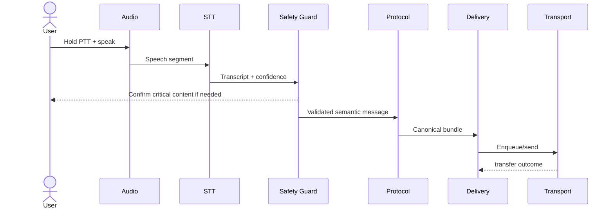
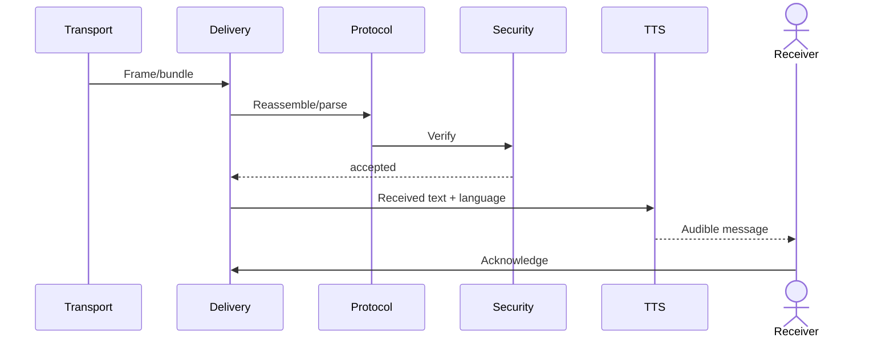

# System Architecture

## 1. Architecture goals

The architecture separates speech, safety, protocol, delivery, networking, and UI so each can be measured and evolved independently.

```text
Experience
   |
Safety / confirmation policy
   |
Speech services
   |
Semantic bundle
   |
Security envelope
   |
Delivery engine
   |
Transport adapters
   |
BLE | local Wi-Fi | relay | bridge
```

## 2. Modules

### `core-audio`
Audio capture, ring buffers, VAD-facing frames, audio focus, microphone lifecycle.

### `core-speech`
STT/TTS runtime abstractions, language packs, normalization, endpointing integration.

### `core-safety`
Critical-span extraction, confidence policies, confirmation state machine.

### `core-protocol`
Canonical semantic bundle, serialization, validation, fragmentation metadata, ACK messages.

### `core-security`
Identity material, authenticated encryption, signatures where required, replay protection.

### `core-delivery`
Durable outbox/inbox, state transitions, deduplication, retry, expiry, acknowledgement handling.

### `transport-ble`
BLE discovery, connection/session management, frame exchange, MTU-aware fragmentation.

### `transport-wifi`
Local Wi-Fi/Wi-Fi Direct transfer through the same transport interface.

### `routing`
Direct, controlled flood, Spray-and-Wait, store-carry-forward, future policies.

### feature modules
PTT, inbox, alerts, diagnostics, onboarding, language-pack management.

## 3. Dependency rules

- UI depends on use cases, never transport internals.
- Transport deals with opaque frames/bundles, never speech models.
- Relay nodes can forward encrypted private bundles without plaintext access.
- Protocol does not depend on Android UI.
- Metrics are emitted from every layer through a common observability interface.
- Security boundaries are explicit and tested.

## 4. Sender sequence



## 5. Receiver sequence



## 6. Concurrency model

No ML inference, disk I/O, cryptographic work, or radio operation on Android main thread.

Long-running operations:
- foreground service where justified;
- structured coroutines;
- cancellable flows;
- lifecycle-safe state restoration.

## 7. Persistence

Durably persist:
- outbound bundles awaiting final state;
- inbox metadata;
- seen-message identifiers/replay window;
- acknowledgement state;
- relay queue;
- model manifests;
- experiment logs where enabled.

Raw audio should not be retained by default.

## 8. Process death

All durable delivery semantics must survive process restart. On reboot/relaunch:
- validate stored records;
- expire stale bundles;
- recover eligible queues;
- avoid duplicate playback;
- restore truthful state.

## 9. Scaling path

### Phase A
One sender, one receiver, direct link.

### Phase B
Multiple peers with direct addressing.

### Phase C
Content-blind relay and bounded propagation.

### Phase D
Delay-tolerant store-carry-forward.

### Phase E
Optional low-rate bridge with the same semantic bundle.

## 10. Architectural invariants

1. Same message ID survives transport changes.
2. “Forwarded” is not “delivered.”
3. A relay does not need STT or TTS.
4. Protocol payload limits are enforced before allocation.
5. All timers use monotonic elapsed time where wall-clock trust is unnecessary.
6. Unknown protocol versions fail safely.
7. Every measured latency stage has explicit start/end markers.
